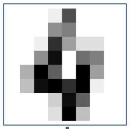
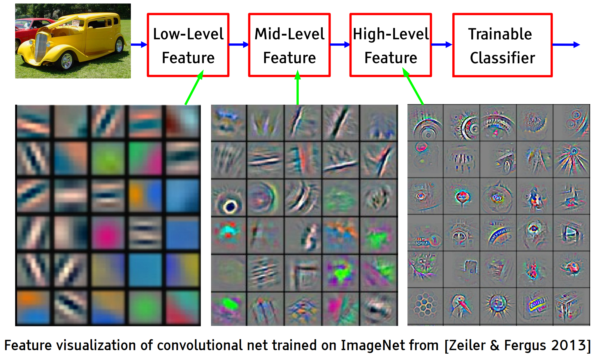
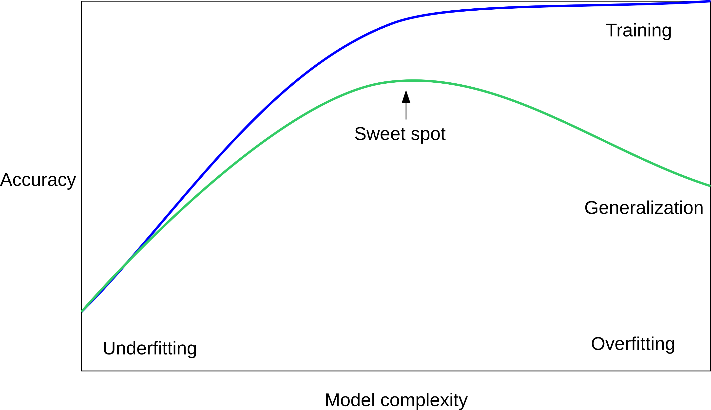
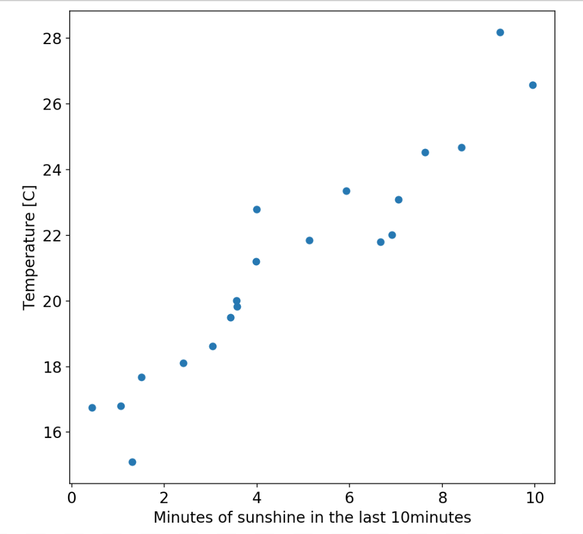

class: middle, center, title-slide

# Deep learning


.footnote[Tim Head, Wild Tree Tech, ETH Zurich, July 2018]

---

# Hello, I am Tim

Physics student at University of Manchester, PhD at Manchester with time
at Fermilab, then research fellow at CERN, then EPFL.

Got interested in machine-learning because I thought it would be an easy way
to get some impressive results ...

Who are you and how did you get interested?

---

# Wild Tree Tech

.center.width-20[]

Tim is a doctor of experimental physics, worked at CERN and EPFL,
contributor to the PyData ecosystem.

Wild Tree Tech builds bespoke solutions for clients all around the world,
from startups to UN organisations.

* digital products that leverage machine-learning and AI,
* teaching machine-learning courses, and
* small and large JupyterHub deployments.

Visit [http://www.wildtreetech.com](www.wildtreetech.com).

---

# Let's go!

Today is all about building a foundation.
* Introduction to numpy and matplotlib
* Standard machine-learning workflow
* over- and underfitting
* performance measures
* the world's simplest neural net
* classifying fashion with keras

Tomorrow: pretrained model and NNs from scratch

Wednesday: image specific operators, transfer learning
---

# Netflix

.width-100[]

---

# Twitter

.width-100[]

---

# Exoplanets

.width-100[]

---

# Higgs Boson

.width-100[]

---

# Tufas

.center.width-90[]

.footnote[Josh Tenenbaum]

---

class: middle, center
# Machine-learning
# vs
# Hand crafted rules

---

# Types of Machine-learning

.larger[
* Supervised
* Unsupervised
* Reinforcement
]

---

# Supervised Learning

.larger[
$$ (x_i, y_i) \propto p(x, y) \text{ i.i.d.}$$
$$ x_i \in \mathbb{R}^p$$
$$ y_i \in \mathbb{R}$$
$$f(x_i) \approx y_i$$
$$f(x) \approx y$$
]

---

# Classification

.center.width-70[]

---

# Regression

.center.width-70[]

---

# Neural networks = Magic?

.width-50.center[]

---

# Neural networks in one slide

A (very) complicated mathematical function. That is it.

Takes in a collection of numbers (pixel intensities) and outputs numbers (class probabilities).

.larger.center[
f() $= [x_0, x_1, x_2, ..., x_7, x_8, x_9]$
]

Neural networks can apply one or many operators to the data.
* final operator performs logistic regression
* all previous operators transform the data from one representation to another.

---

# A Directed Acyclical Graph

.width-80.center[]

Operators $\phi$ with parameters $w$ applied to data $x$.

Together they form the function $f(x; w^{(1)}, w^{(2)})$.

$w^{(1)}$ and $w^{(2)}$ will be "learnt" from the data.

.footnote[From https://documents.epfl.ch/users/f/fl/fleuret/www/dlc/]

---

# Deep Neural Networks

.width-100.center[]

---

# What is Deep Learning?

.width-100.center[]

Use fixed feature extractor and tune last step using supervised learning.

---

# What is Deep Learning?

.width-100.center[]

Adjust parameters of every step using supervised learning.

--

Key point: feed raw features to algorithm, learn everything else.

Ideal for problems where you do not know a good representation of the data.

Pose estimation: https://storage.googleapis.com/tfjs-models/demos/posenet/camera.html

---

# Why now?

Recent resurgence of neural networks thanks to deep learning.
Isn’t it all just hype?

* Fifty years of research into machine learning.
* GPUs! Vastly more computing power available today.
* New ideas and understanding.
* More data with labels.
* Tools and culture of collaborative and reproducible science.
* Resources and efforts from large corporations.

---

# Neural Networks as feature transformers

How to solve the circle-incircle problem with a linear classifier?

http://playground.tensorflow.org/#activation=relu&batchSize=17&dataset=circle&regDataset=reg-plane&learningRate=0.1&regularizationRate=0&noise=10&networkShape=3&seed=0.14077&showTestData=false&discretize=false&percTrainData=50&x=true&y=true&xTimesY=false&xSquared=false&ySquared=false&cosX=false&sinX=false&cosY=false&sinY=false&collectStats=false&problem=classification&initZero=false&hideText=false

---

# Network architectures

.width-100.center[]

.footnote[
LeCun, Y., Bottou, L., Bengio, Y., and Haffner, P. (1998). Gradient-based learning applied to document recognition.
]

---

# Hierarchical representation

.center.width-100[]

---

# VGG-16

.center.width-100[]

.footnote[Simonyan, Karen, and Zisserman. "Very deep convolutional networks for large-scale image recognition." (2014)]

---

# VGG in Keras

.smaller[
```python
    model.add(Convolution2D(64, 3, 3, activation='relu',input_shape=(3,224,224)))
    model.add(Convolution2D(64, 3, 3, activation='relu'))
    model.add(MaxPooling2D((2,2), strides=(2,2)))

    model.add(Convolution2D(128, 3, 3, activation='relu'))
    model.add(Convolution2D(128, 3, 3, activation='relu'))
    model.add(MaxPooling2D((2,2), strides=(2,2)))

    model.add(Convolution2D(256, 3, 3, activation='relu'))
    model.add(Convolution2D(256, 3, 3, activation='relu'))
    model.add(Convolution2D(256, 3, 3, activation='relu'))
    model.add(MaxPooling2D((2,2), strides=(2,2)))

    model.add(Convolution2D(512, 3, 3, activation='relu'))
    model.add(Convolution2D(512, 3, 3, activation='relu'))
    model.add(Convolution2D(512, 3, 3, activation='relu'))
    model.add(MaxPooling2D((2,2), strides=(2,2)))

    model.add(Convolution2D(512, 3, 3, activation='relu'))
    model.add(Convolution2D(512, 3, 3, activation='relu'))
    model.add(Convolution2D(512, 3, 3, activation='relu'))
    model.add(MaxPooling2D((2,2), strides=(2,2)))

    model.add(Flatten())
    model.add(Dense(4096, activation='relu'))
    model.add(Dropout(0.5))
    model.add(Dense(4096, activation='relu'))
    model.add(Dropout(0.5))
    model.add(Dense(1000, activation='softmax'))
```
]

---

.left-column[
# ResNet
]

.footnote[
.left-column[
He, Kaiming, et al. "Deep residual learning for image recognition." CVPR. 2016.
]
]

.right-column[
<div style="margin-top: -15px">
.center.width-80[]
</div>
]

Even deeper models:

34, 50, 101, 152 layers

---

.left-column[
# ResNet
]

.footnote[
.left-column[
He, Kaiming, et al. "Deep residual learning for image recognition." CVPR. 2016.
]
]

.right-column[
<div style="margin-top: -15px">
.center.width-80[]
</div>
]

.left-column[
A block learns the residual with respect to identity:

.center.width-90[]

- Good optimization properties
]
---

# Deeper is better

.width-90[]

.footnote[
from Kaiming He slides "Deep residual learning for image recognition." ICML. 2016.
]

---

# State of the art models ...

... require millions of images and days or weeks of GPU time to train. Don't usually
have either. What to do?

(It is becoming cheaper/faster https://dawn.cs.stanford.edu/benchmark/#imagenet.)

---

# Transfer learning

.center.width-80[]

* Treat a whole network as a "feature transformer"
* Use the last or second to last layer as input features to a logistic regression
  or a small neural network which is trained on our small dataset
* http://teachablemachine.withgoogle.com/

---

# Cat or dog?

How good are you compared to a computer at quickly identifying cats vs dogs?

--

.center.width-60[]

.footnote[Elsayed et al, https://arxiv.org/abs/1802.08195]

---

# Cat or dog?

How good are you compared to a computer at quickly identifying cats vs dogs?

What is the left picture? What is the right picture?

---

# Universal Perturbation

.center.width-50[]

.footnote[Moosavi-Dezfooli et al, https://arxiv.org/abs/1610.08401v1]

---

# Do NNs understand what they see?

.center.width-100[]

.footnote[Deep neural networks are easily fooled: High confidence predictions for unrecognizable images, http://www.evolvingai.org/fooling]

---

# What do you see?

.center.width-100[]

---

class: middle,center
# (Short) Coffee ☕️

---

# Numpy and matplotlib

A 30minute tour of numpy and matplotlib.

Open `10-numpy-matplotlib.ipynb`.

.center.width-50[]

.center.width-50[]

---

# Machine-learning lingo

Introduce some basic notation, APIs and workflow that applies to all machine-learning.

Will use tools from scikit-learn, the goto machine-learning library for everyone.

Extremely [well documented](http://scikit-learn.org/stable/documentation.html), very [high quality](https://github.com/scikit-learn/scikit-learn#scikit-learn), in use at [`$yourfavouritecompany`](http://scikit-learn.org/stable/testimonials/testimonials.html).

.center.width-50[]

---

# Notation

I will use $X$ to represent our data. This means $X$ is a matrix of shape $n \times p$ ($n$ samples and $p$ features).

| $i$ | Temperature | Humidity | Percipitation |
| --- | ----------- | -------- | ------------- |
| 0   | 12C         | 74%      | 3mm           |
| 1   | 24C         | 67%      | 0mm           |
| 2   | 4C          | 91%      | 13mm          |
| $n$ | (...)       | (...)    | (...)         |

Each row is a **sample** and each column a **feature**.

---

# Notation

I will use $y$ to represent our labels. This means $y$ is a vector with $n$
entries. This is what we are trying to predict for unseen samples. One for each sample.

| $i$ | Comfortable? |
| --- | ------------ |
| 0 | yes          |
| 1 | yes          |
| 2 | no           |
| $n$ | (...)        |

For each sample we have one **label**.

---

# Notation

For regression we will use $y$ to represent our **targets**. This means $y$ is a vector with $n$ entries. This is what we are trying to predict for unseen samples. One for each sample.

| $i$ | Sunshine minutes |
| --- | ------------ |
| 0 | 14          |
| 1 | 28          |
| 2 | 2           |
| $n$ | (...)        |

---

# Machine-learning foundations

A 30minute tour of scikit-learn.

Open `20-machine-learning-lingo.ipynb`.

---

class: middle,center
# Lunch

---

# Measuring your performance

* keep yourself honest
* over- and under-fitting, the sweet spot
* there are many different metrics for measuring performance:
  - accuracy
  - ROC AUC
  - recall and precision
  - basically: http://scikit-learn.org/stable/modules/classes.html#sklearn-metrics-metrics
  - often people start with accuracy but often it is inappropriate
* cross-validation helps get better estimates of your performance as well as
  an uncertainty.
  - It isn't some kind of magic spell that protects you from evil.
  - just because you are doing CV doesn't mean you are doing it right.


---

# $k$ Nearest Neighbours

.center.width-70[]

<div style="margin-top: -20px">
$$f(x) = y_i, i = \mathrm{argmin}_j || x_j - x ||$$
</div>

---

# $k$ Nearest Neighbours ($k=1$)

.center.width-70[]

---

# Accuracy ($k=1$)

What is the accuracy of this classifier?

---

# Accuracy ($k=1$)

What is the accuracy of this classifier?

| $k$ | Train | Test |
| --- | ----- | ---- |
| 1 | 1.0 | 0.85 |

Why is the accuracy 1 on the training set?

---

# Generalisation error

We are interested in how well the classifier performs on data from the future.

Split off a fraction of the dataset at the start, use it to simulate the future.

Training data:

| $i$ | Feature 1 | Feature 2 |
| --- | ----------- | -------- |
| 0   | 2.14         | 5.234     |
| 1   | 1.124        | 0.32      |
| 2   | -2.24       | 2.32      |
| 3   | -1.24        | 3.23      |

Testing data:

| $i$ | Feature 1 | Feature 2 |
| --- | ----------- | -------- |
| 4   | 5.34        | 6.34    |
| 5   | 2.24          | -5.23      |

---

# Generalisation error

We are interested in how well the classifier performs on data from the future.

Split off a fraction of the dataset at the start, use it to simulate the future.

Sounds simple, but when the pipeline gets more complex mistakes creep in.

Number one reason journal articles are rejected is a mistake in the evaluation
protocol.

---

# $k$ Nearest Neighbours ($k=10$)

.center.width-70[]

---

# $k$ Nearest Neighbours ($k=10$)

.center.width-70[]

---

# What happens if you change $k$?

.gallery[


]

---

# What happens if you change $k$?

.center.width-70[]

---

# Under- and Overfitting

.center.width-90[]

---

# Under- and Overfitting

.center.width-90[]

---

# Under- and Overfitting

.center.width-90[]

Only way to find the sweet spot is to try many different combinations of
hyper-parameters. There usually isn't a nice linear mapping from hyper-parameters
to "model complexity".

---

# What is our accuracy on future data?

.center.width-70[]

---

# Notebooks

* `32-three-fold-way.ipynb` illustrates why we need to keep a third dataset
secret

---

# Three way split

Pro: easy, fast

Con: high variance, "wastes" data

.center.width-100[]

Keep some data (test set) locked away until you are done to simulate data
from the future.

---

# Cross-validation

Pro: stable estimate, better use of data

Con: slower

.center.width-100[]

---

# Notebooks

* `31-underfitting-overfitting.ipynb` illustrates over-, underfitting, and the
  sweetspot for a simple regression problem

--

Are we done yet? No!

We need to combine splitting off a test set and the use of cross-validation.

---

# Cross-validation with a test set

.center.width-90[]

---

# The master algorithm

.center.width-90[]

---

# Cross-validation strategies

There are many strategies for splitting your data. Here a few.

You can find several more in the scikit-learn documentation:
http://scikit-learn.org/stable/modules/classes.html#splitter-classes

---

# StratifiedKFold

.center.width-100[]

Makes sure class fractions in the full dataset are correctly
represented in each split.

---

# GroupKFold

.center.width-90[]

All samples from the same group are always in the same split.

* Medical patients
* Satellite images

---

# Notebooks

* `33-the-full-monty.ipynb` tune hyper-parameters and get an unbiased
  performance estimate.

.center.width-60[]

---

# Accuracy

What fraction of classes did the model predict correctly.

$$ \mathrm{Accuracy} = \frac{\mathrm{TP}+\mathrm{TN}}{\mathrm{TP}+\mathrm{TN}+\mathrm{FP}+\mathrm{FN}} $$

.center.width-90[]

---

# Precision

How many selected items are relevant?

$$ \mathrm{Precision} = \frac{\mathrm{TP}}{\mathrm{TP}+\mathrm{FP}} $$

.center.width-90[]

---

# Recall

How many relevant items are selected?

$$ \mathrm{Recall} = \frac{\mathrm{TP}}{\mathrm{TP}+\mathrm{FN}} $$

.center.width-90[]

---

# Problems with accuracy

Special offer: Tim's credit card fraud detector. 99.99% accurate!

---

# Problems with accuracy

Special offer: Tim's credit card fraud detector. 99.99% accurate!

If your classes are (very) imbalanced then accuracy is not a good measure.

Tim's favourite baseline: the [`DummyClassifier`](http://scikit-learn.org/stable/modules/generated/sklearn.dummy.DummyClassifier.html).

---

# ROC Area Under Curve (ROC AUC)

Works well for unbalanced classes, shows you what trade offs you can make.

.center.width-80[]

---

# Changing the threshold

By default scikit-learn classifiers assign classes based on the midpoint of
the possible classifier output (0.5). You can change this threshold to make
different trade-offs.

```
X_train, X_test, y_train, y_test = train_test_split(X, y)

knn = KNeighborsClassifier().fit(X_train, y_train)
y_pred = knn.predict(X_test)
print(classification_report(y_test, y_pred))
```

```
             precision    recall  f1-score   support

      False       0.86      0.86      0.86        51
       True       0.86      0.86      0.86        49

avg / total       0.86      0.86      0.86       100
```
---

# Changing the threshold

By default scikit-learn classifiers assign classes based on the midpoint of
the possible classifier output (0.5). You can change this threshold to make
different trade-offs.

```
X_train, X_test, y_train, y_test = train_test_split(X, y)

knn = KNeighborsClassifier().fit(X_train, y_train)
*y_pred = knn.predict_proba(X_test)[:, 1] > 0.8
print(classification_report(y_test, y_pred))
```

```
             precision    recall  f1-score   support

      False       0.70      0.94      0.80        51
       True       0.90      0.57      0.70        49

avg / total       0.80      0.76      0.75       100
```
---

# Confusion matrix

.center.width-90[]

---

class: middle, center
# Day 2

Update your git repository

---

# The plan

* neural networks in keras
* linear regression
* logistic regression
* one hidden layer neural network
* spotting boats

---

# Neural networks = Magic?

.width-50.center[]

---

class: middle,center
# The World's Simplest Neural Network

---

# Neural networks in keras

`10-intro-keras.ipynb`

Get started with keras by building a simple neural network and experimenting
with different optimisers. Get your feet wet with keras.

---

# Intuition about what NNs are doing

This is a good (but mind bending) article about how to think about why it is that neural entworks can solve problems that can't be solved with a linear classifier:
http://colah.github.io/posts/2014-03-NN-Manifolds-Topology/

In particular the example towards the end which illustrates how to
solve a 1D problem.

---

class: middle,center
# Let's build a neural network from scratch

---

# More Sunshine, More Hot

.width-60.center[]

Linear regression problem: $ y = Wx +b $

Use mean squared error to judge how good predictions are and adjust $W$ and $b$
to improve prediction.

---

# Optimise parameters

We need to find the best values of the parameters $W$ and $b$.

What is best? - need a quantative way to define best.

--

Loss functions: measure how good our solution is.

--

Better parameters have lower loss. Use that to improve our parameters!

Jargon: stochastic gradient descent optimiser.

---

# Coding

Two notebooks:
1. compute loss and implement simple optimiser (`20-loss.ipynb`)
2. use results from 1. to build a class that implements linear regression (`21-linear-regression.ipynb`)

---

# Linear regression outro

* loss functions measure how well we are doing, lower is better
* use gradient of loss function to update parameters of the model
* need to compute analytic gradients
* gradient descent: $w \leftarrow w - \alpha \frac{\partial L}{\partial w}$
* learning rate $\alpha$ is a hyper-parameter we need to tune by hand
* stochastic gradient descent uses only a few samples to compute gradient at
  each step

---

class: middle, center
# Logistic regression

---

# More Sunshine, More Hot

.width-60.center[]

Linear regression problem: $ y = Wx +b $

Use mean squared error to judge how good predictions are and adjust $W$ and $b$
to improve prediction.

---

# Is it too hot?

.width-60.center[]

Predict binary outcome (zero or one) from input variable(s).

Use a linear classifier.

---

# Is it too hot?

.width-40.center[]

$$\mathbf{y} = \mathbf{W}x + \mathbf{b}$$

$\mathbf{y}$ and $\mathbf{b}$ are now vectors, $\mathbf{W}$ is a matrix, and
$\mathbf{y}$ contains the score for each class.

What we’d really like is class probabilities.

---

# Is it too hot?

.width-40.center[]

$$\binom{y_0}{y_1} = \binom{W_0}{W_1} (x) + \binom{b_0}{b_1}$$

$\mathbf{y}$ and $\mathbf{b}$ are now vectors, $\mathbf{W}$ is a matrix (if we had more than one feature), and
$\mathbf{y}$ contains the score for each class.

What we’d really like is class probabilities.

---

# The Softmax

$$
softmax(\mathbf{x}) = \frac{1}{\sum_{i=1}^{n}{e^{x_i}}}
\cdot
\begin{bmatrix}
  e^{x_1}\\\\
  e^{x_2}\\\\
  \vdots\\\\
  e^{x_n}
\end{bmatrix}
$$

Normalise elements of $\mathbf{x}$ so that they sum to 1. We can interpret
the new vector as a set of probabilities.

.width-40.center[]

Compact notation for linear classifier (or logistic regression):
$$ \mathbf{y} = \mathsf{softmax} \( \mathbf{W} x + \mathbf{b} \) $$

$y$ now contains the normalised probabilities for each class.

---

# Logistic Regression

We have:
* function $f(x; W, b)$ that we can use to make predictions $\hat{y}$
    - $f(x; W, b) = \mathsf{softmax}(\mathbf{W} x + \mathbf{b})$
* a loss function to measure how well our model is doing $L(\hat{y}, y)$
    - log-loss or cross-entropy: $y\log p + (1-y) \log(1-p)$
* find optimal values of $\mathbf{W}$ and $\mathbf{b}$ by gradient descent
    - compute gradient of $L$ w.r.t. each parameter $\frac{dL}{dW}$ and $\frac{dL}{db}$
    - update parameters $W \leftarrow W + \alpha \frac{dL}{dW}$ and $b \leftarrow b + \alpha \frac{dL}{db}$

---

# Logistic regression

Next notebook extends the linear regression example to implement logistic
regression. From there it is only a small step to a real neural network.

Computing the gradients is a bit more tricky here. If you are good at
linear algebra attempt it, but keep an eye on the time.

---

# Notebook

* `22-logistic-regression.ipynb` turn your linear regression notebook into
  a hand written digit classifier that uses logistic regression
* `23-multi-layer-network.ipynb` extends your logistic regression model
  into a full features neural network. Using just numpy.
* build a keras model that implements your neural network from
  `23-multi-layer-network.ipynb`. You can base it on the keras models we
  built yesterday. You should now be able to explain every part of yesterday's
  notebook.

---

# Logistic regression - outro

* Mostly things are as they were for linear regression but a bit more
  "vectorised".
* This game essentially continues the more and more you add fully-connected
  layers.

---

class: middle,center
# (Short) Coffee ☕️

---

# Ships

Download data from https://osf.io/f3cu4/ You want `shipsnet.json` and the contents
of the `scenes/` folder. I placed everything in a subfolder called `data/`.

`30-explore-data.ipynb` t oget started.

Approach: build a classifier that works on small tiles, slide a window with the
size set to the size of your tiles over the big scene.

`30-explore-data.ipynb` to get you started, otherwise you are on your own.

Build a ship finder!

Some things to think about:
* what is your baseline model? `DummyClassifier`, `LogisticRegression`?
* try a simple model first
* how well does your classifier work on images from some other satellite
  image datasets?

---

class: middle, center
# Day 3

---

# The plan

* convolutions and image specific operators
* pretrained models in keras
* transfer learning
* auto encoders
* spotting boats or planes

---

class: middle, center
# Image specific operators

---

# Why not Fully Connected?

Standard Dense Layer for an image input:

```python
x = Input((640, 480, 3), dtype='float32')
# shape of x is: (None, 640, 480, 3)
x = Flatten()(x)
# shape of x is: (None, 640 x 480 x 3)
z = Dense(1000)(x)
```

How many parameters in the Dense layer?

--

$640 \times 480 \times 3 \times 1000 + 1000 = 922M !$

Spatial organization of the input is destroyed by `Flatten`

The solution is convolutional layers.

---

# Convolutional Neural Networks

.width-100.center[]

.footnote[
LeCun, Y., Bottou, L., Bengio, Y., and Haffner, P. (1998). Gradient-based learning applied to document recognition.
]

---

# Convolution

.center[]

- slide a small ($3 \times 3$) window over the image ($5 \times 5$)
- several filters (neurons) per convolutional layer
- each output neuron is parametrised with a $3 \times 3$ weight matrix $\mathbf{w}$

.footnote[
These slides use convolution visualisations by V. Dumoulin available at https://github.com/vdumoulin/conv_arithmetic]

---

# Convolution

.center[]

The activation is obtained by sliding the $3 \times 3$ window over the image
and computing:

$$ z(x) = relu(\mathbf{w}^T x + b) $$

at each step. Where $x$ is a $3 \times 3$ chunk (dark area) of the image (blue array).

---

# Advantages

Local connectivity:
- Output depends only on a few local inputs
- Translational invariance

Compared to Fully connected/Dense:
- Parameter sharing, reduced number of parameters
- Make use of spatial structure: a good assumption for vision!

---

# As Code

```python
input_image = Input(shape=(28, 28, 3))
*x = Conv2D(32, 5, activation='relu')(input_image)
*x = MaxPool2D(2, strides=2)(x)
*x = Conv2D(64, 3, activation='relu')(x)
*x = MaxPool2D(2, strides=2)(x)
x = Flatten()(x)
x = Dense(256, activation='relu')(x)
x = Dense(10, activation='softmax')(x)
convnet = Model(inputs=input_image, outputs=x)
```

Two layers of convolution and pooling implemented using keras.

---
# Convolutions illustrated

`20-image-convolutions-with-keras.ipynb`

---

# Colour channels

Coloured image = tensor of shape `(height, width, channels)`

Convolutions are usually computed for each channel and summed:

.center.width-50[]

---

# Multiple convolutions (or filters)

.center.width-50[]
---

# Multiple convolutions (or filters)

.center.width-50[]
---

# Multiple convolutions (or filters)

.center.width-50[]
---

# Multiple convolutions (or filters)

.center.width-50[]
---

# Multiple convolutions (or filters)

.center.width-50[]

```python
input_image = Input(shape=(28, 28, 3))
x = Conv2D(4, 5, activation='relu')(input_image)
```
---

# Strides

- Strides: increment step size for the convolution operator
- Reduces the size of the ouput map

.center[]

.center.small[
Example with kernel size $3 \times 3$ and a stride of $2$ (image in blue)
]

---

# Padding

- Padding: artifically fill borders of image
- Useful to keep spatial dimension constant across filters
- Useful with strides and large receptive fields
- Usually: fill with 0s

.center.width-40[]

---

# Number of parameters

Kernel or Filter shape $(F, F, C^i, C^o)$

.left-column[
- $F \times F$ kernel size,
- $C^i$ input channels
- $C^o$ output channels
]

.right-column[
  .width-40.center[]
]

--

.reset-column[
]

Number of parameters: $(F \times F \times C^i + 1) \times C^o$

--

Activations or Feature maps shape:
- Input $(W^i, H^i, C^i)$
- Output $(W^o, H^o, C^o)$

$W^o = (W^i - F + 2P) / S + 1$


???

The **filters** hold the **trainable parameters** of the model (excluding the biases).

The **feature maps** are the outputs (or **activations**) of convolution
layers when **applied to a specific batch of images**.

---

# Pooling

- Spatial dimension reduction
- Local invariance
- No parameters: typically maximum or average of 2x2 units

.center.width-80[]

.footnote[Schematic from Stanford http://cs231n.github.io/convolutional-networks]

---

# Two more layer types

* Drop out - a good way to regularise your network
* Batch Norm - normalise the data at each layer of the network

---

# Network architectures

.width-100.center[]

.footnote[
LeCun, Y., Bottou, L., Bengio, Y., and Haffner, P. (1998). Gradient-based learning applied to document recognition.
]

---

# Classic Convolutional Network Structure

* Input

--

* Conv blocks
    - Convolution + activation (relu)
    - Convolution + activation (relu)
    - ...
    - Maxpooling 2x2

    (repeat these a few times)

--

* Output
    - Fully connected layers
    - Softmax

---

# Hierarchical representation

.center.width-100[]

---

# VGG-16

.center.width-100[]

.footnote[Simonyan, Karen, and Zisserman. "Very deep convolutional networks for large-scale image recognition." (2014)]

---

# VGG in Keras

.smaller[
```python
    model.add(Convolution2D(64, 3, 3, activation='relu',input_shape=(3,224,224)))
    model.add(Convolution2D(64, 3, 3, activation='relu'))
    model.add(MaxPooling2D((2,2), strides=(2,2)))

    model.add(Convolution2D(128, 3, 3, activation='relu'))
    model.add(Convolution2D(128, 3, 3, activation='relu'))
    model.add(MaxPooling2D((2,2), strides=(2,2)))

    model.add(Convolution2D(256, 3, 3, activation='relu'))
    model.add(Convolution2D(256, 3, 3, activation='relu'))
    model.add(Convolution2D(256, 3, 3, activation='relu'))
    model.add(MaxPooling2D((2,2), strides=(2,2)))

    model.add(Convolution2D(512, 3, 3, activation='relu'))
    model.add(Convolution2D(512, 3, 3, activation='relu'))
    model.add(Convolution2D(512, 3, 3, activation='relu'))
    model.add(MaxPooling2D((2,2), strides=(2,2)))

    model.add(Convolution2D(512, 3, 3, activation='relu'))
    model.add(Convolution2D(512, 3, 3, activation='relu'))
    model.add(Convolution2D(512, 3, 3, activation='relu'))
    model.add(MaxPooling2D((2,2), strides=(2,2)))

    model.add(Flatten())
    model.add(Dense(4096, activation='relu'))
    model.add(Dropout(0.5))
    model.add(Dense(4096, activation='relu'))
    model.add(Dropout(0.5))
    model.add(Dense(1000, activation='softmax'))
```
]

---

.left-column[
# ResNet
]

.footnote[
.left-column[
He, Kaiming, et al. "Deep residual learning for image recognition." CVPR. 2016.
]
]

.right-column[
<div style="margin-top: -15px">
.center.width-80[]
</div>
]

Even deeper models:

34, 50, 101, 152 layers

---

.left-column[
# ResNet
]

.footnote[
.left-column[
He, Kaiming, et al. "Deep residual learning for image recognition." CVPR. 2016.
]
]

.right-column[
<div style="margin-top: -15px">
.center.width-80[]
</div>
]

.left-column[
A block learns the residual with respect to identity:

.center.width-90[]

- Good optimization properties
]
---

# Deeper is better

.width-90[]

.footnote[
from Kaiming He slides "Deep residual learning for image recognition." ICML. 2016.
]

---

# State of the art models

Require millions of images and days or weeks of GPU time to train. Don't usually
have either. What to do?

(It is becoming cheaper/faster https://dawn.cs.stanford.edu/benchmark/#imagenet.)

---

# Transfer learning

.center.width-80[]

* Treat a whole network as a "feature transformer"
* Use the last or second to last layer as input features to a logistic regression
  or a small neural network which is trained on our small dataset
* http://teachablemachine.withgoogle.com/

---

# How does the teachable machine work?

Process camera input through a small, fast, made for mobile neural network
that was trained on ImageNet.

Take the output of the NN and treat it as features, fit a Logistic Regression
to do the actual classification.

Checkout `learning_game.py` to do it yourself.

---

# Cat or dog?

How good are you compared to a computer at quickly identifying cats vs dogs?

--

.center.width-60[]

.footnote[Elsayed et al, https://arxiv.org/abs/1802.08195]

---

# Cat or dog?

How good are you compared to a computer at quickly identifying cats vs dogs?

What is the left picture? What is the right picture?

---

# Universal Perturbation

.center.width-50[]

.footnote[Moosavi-Dezfooli et al, https://arxiv.org/abs/1610.08401v1]

---

# Do NNs understand what they see?

.center.width-100[]

.footnote[Deep neural networks are easily fooled: High confidence predictions for unrecognizable images, http://www.evolvingai.org/fooling]

---

# What do you see?

.center.width-100[]

---

# Thank you!

---

class: bottom, center

Fin.
